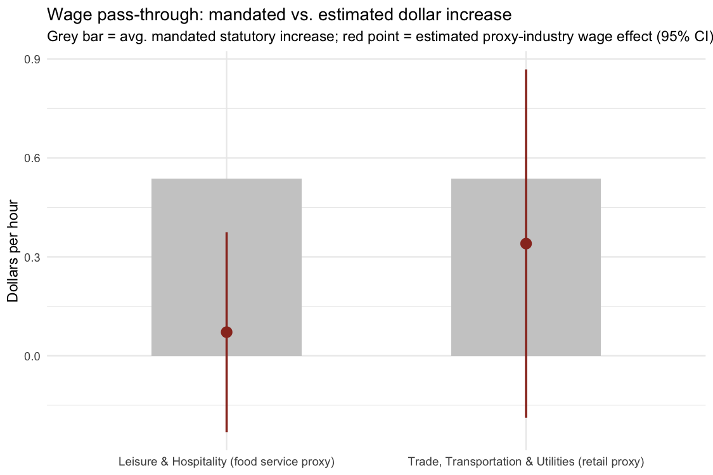
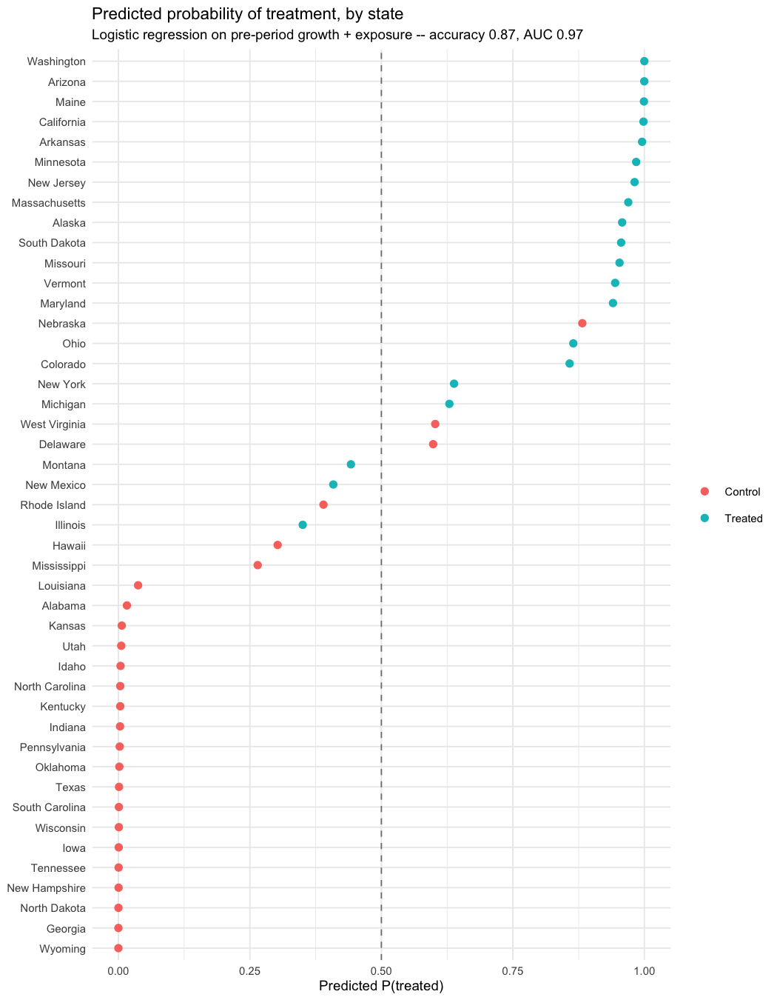
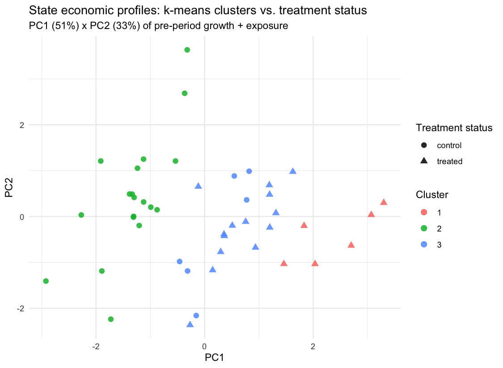

# State Minimum Wage Increases and Low-Wage Employment

[](https://github.com/Charith-Reddy-Pareddy/min-wage-difference-in-differences-study/actions/workflows/ci.yml)
[](LICENSE)
[](https://charith-reddy-pareddy.github.io/min-wage-difference-in-differences-study/)

A difference-in-differences study of the 2021 round of state minimum-wage
increases, extended beyond a single average treatment effect to ask how
the employment response varies with pre-policy wage exposure.

**Finding:** the baseline estimate is negative but not credible as a
causal effect — pre-trends are violated for food service, and it's
highly sensitive to differential COVID recovery. The exposure-gradient
hypothesis is underpowered *and*, per four independent checks,
confounded by a pre-existing association unrelated to the 2021 policy.
See [Results at a Glance](#results-at-a-glance).

## Research Questions

**Primary:** How does the employment response to state minimum-wage
increases vary with pre-policy minimum-wage exposure across low-wage
industries?

**Secondary:**
1. Does minimum-wage treatment affect employment in food service and retail?
2. Is the effect larger where exposure is greater?
3. Does the effect differ across Census regions?
4. How sensitive are these conclusions to alternative treatment definitions
   and inference procedures?
5. Did the increases actually raise earnings in low-wage industries, and
   by how much relative to the size of the mandate (pass-through)? See
   [Wage Pass-Through](#wage-pass-through).
6. Is treatment status itself predictable from pre-period state
   characteristics — and do states form natural economic clusters that
   track treatment status? See
   [Treatment Assignment: Predictability & Clustering](#treatment-assignment-predictability--clustering).

This is a Card-Krueger-style state minimum-wage DiD design; the
contribution is a specific empirical angle (modeling how the effect
scales with exposure) plus stress-testing that model with every
credibility check the data will support.

## Key Metrics

| | |
|---|---|
| **Sample** | 50 states, quarterly 2015-2022 (1,260 obs in the estimation panel) — 20 treated, 25 control, 5 excluded |
| **Model A, β₃** (avg. effect) | -0.025 food service (p=0.12), -0.010 retail (p=0.39); significant only in the ≥$0.50 subsample |
| **Model C, β₄** (exposure gradient) | 0.167 food service (p=0.34), -0.005 retail (p=0.95) — noisy and inconsistent in sign |
| **Robustness on β₄** | 4/4 independent checks (placebo, permutation, event study, spec curve) flag it as confounded |
| **Inference** | State-clustered SEs, wild cluster bootstrap, 10,000-rep permutation test, Monte Carlo power analysis |
| **Wage pass-through** | 13% (food service proxy, p=0.65) / 63% (retail proxy, p=0.22) of the mandated increase — neither significant |
| **Treatment predictability** | Logistic regression on pre-period growth + exposure: 87% accuracy, AUC 0.97 — highly predictable |
| **State clustering** | k-means (k=3) on the same features: 2 of 3 clusters are essentially pure treated/control (χ²p<0.0001) |
| **Engineering** | 31 R scripts + a Python ML subproject, 163 R test blocks (all passing), CI on every push, `make all` for full reproduction |

## Results at a Glance

| Question | Result | Interpretation |
|---|---|---|
| Average employment effect | Negative but not robust | Weak causal evidence |
| Parallel trends | Violated (food service) | Major identification concern |
| COVID sensitivity | Large change once controlled for | Confounding likely |
| Exposure gradient (β₄) | Inconclusive and confounded | Underpowered, not "no effect" |
| Placebo / permutation / event study / spec curve (β₄) | All 4 flag a pre-existing exposure-outcome link | Convergent evidence, not one fluke |
| Exposure vs. COVID severity | Significant negative correlation | A candidate mechanism — but controlling for it barely moves the placebo effect |
| Multiple-testing correction | None of the 4 confirmatory tests survive Holm | Consistent with "not robust," now formal |
| Leave-one-state-out | Estimate stable across all 20 drops | No single state drives Model A |
| Wage pass-through | 13%/63% of the mandated increase, neither significant | Consistent with underpowered, not "no pass-through" |
| Is treatment predictable from pre-period data? | Yes — 87% accuracy, AUC 0.97 | Another angle on non-random assignment |
| Do states cluster by treatment status? | Yes — 2/3 k-means clusters are nearly pure | Convergent with the predictability result |

## Key Figures

<table>
<tr>
<td width="50%">

**Which states were treated, and by how much**


</td>
<td width="50%">

**Event study: pre-trends don't hold for food service**


</td>
</tr>
<tr>
<td width="50%">

**Baseline vs. COVID-adjusted estimate**


</td>
<td width="50%">

**Pre-2021 exposure distribution by industry**


</td>
</tr>
</table>

**Does the treatment effect scale with exposure?**


**All four confirmatory estimates at a glance**


**Every reasonable band × sample × industry choice, ranked**


**Exposure predicts COVID severity — a candidate mechanism for the confound**


More figures — model diagnostics, permutation-test null distributions,
power-analysis curves, the beta4 event study and forest plot — are in
`reports/figures/` and embedded in the
[full report](reports/final_report.Rmd).

## Final Report

**[Read the rendered report (HTML)](https://github.com/Charith-Reddy-Pareddy/min-wage-difference-in-differences-study/releases/tag/v1.0-report)**
or **[download the PDF](https://github.com/Charith-Reddy-Pareddy/min-wage-difference-in-differences-study/releases/download/v1.0-report/final_report.pdf)**
— no cloning required. Or render
[reports/final_report.Rmd](reports/final_report.Rmd) directly:

```
Rscript -e 'rmarkdown::render("reports/final_report.Rmd")'   # HTML
make report-pdf                                               # + PDF, via headless Chrome
```

(needs [pandoc](https://pandoc.org) — `brew install pandoc` on macOS — for
the HTML, and Chrome/Chromium installed locally for the PDF; see
`scripts/render_report_pdf.R` for why it's a headless-Chrome print
rather than a LaTeX pipeline).

## Wage Pass-Through

A new research question, not a re-analysis of the one above: did the
2021 increases actually raise **earnings** in low-wage industries, and
by how much relative to the dollar size of the mandate (pass-through)?
Everything above asks whether employment fell; this asks whether the
policy did the thing it was actually meant to do.

**Data limitation, found by direct request** (`R/29_wage_passthrough.R`):
BLS/FRED do not publish state-level average hourly earnings at the
detailed NAICS-722 (food service) or 44-45 (retail trade) level the
employment analysis uses — every candidate series ID at that resolution
404s. The finest available state-level breakdown is the CES
**supersector**: "Leisure and Hospitality" (nests food service, but also
accommodation and arts/entertainment/recreation) as the closest proxy for
food service, and "Trade, Transportation, and Utilities" (nests retail,
but also wholesale trade, transportation, and utilities) as the closest
proxy for retail. Both are broader than the industries used elsewhere in
this study, so **this answers a related but not identical question** —
not "did retail workers' wages rise" but "did wages in retail's broader
supersector rise."

| Proxy industry | treated_post (log pts) | p | Mandated $/hr | Estimated $/hr | Pass-through |
|---|---|---|---|---|---|
| Leisure & Hospitality (food service proxy) | 0.0044 | 0.647 | $0.54 | $0.07 | 13% |
| Trade, Transportation & Utilities (retail proxy) | 0.0144 | 0.217 | $0.54 | $0.34 | 63% |



Neither estimate is statistically significant, and the food-service
proxy's confidence interval crosses zero on both sides — consistent
with this study's broader theme that these designs are underpowered at
the observed effect sizes, not evidence that pass-through is genuinely
13%/63% versus some other number. The likeliest reason both estimates
sit well under 100%: the supersector proxies include large numbers of
workers (hotel managers, arts/entertainment/recreation staff, wholesale
and utilities employees) who were never near the minimum wage to begin
with, diluting any real effect on the low-wage workers actually
targeted.

## Treatment Assignment: Predictability & Clustering

Two more angles, chosen to cover STAT 240/340-style techniques this
project hadn't used yet (chi-square test of independence, logistic
regression, k-means, PCA) — and not just as coursework coverage: both
turn out to independently reinforce the confounding story already told
above (β₄'s pre-existing exposure–outcome link, the exposure–COVID
correlation), from angles that don't depend on either of those.

**Is treatment status independent of Census region?**
(`R/30_treatment_predictability.R`) A chi-square test of independence
says no (χ²=8.0, df=3, p=0.046) — the South is heavily under-represented
among treated states (2 of 20) relative to control (12 of 25).

**Is treatment status predictable from pre-period state
characteristics?** A logistic regression on pre-period (2019-2020) GDP
growth, population growth, and food-service exposure — the same
variables used elsewhere in this study, not new ones picked for this
check — classifies treated vs. control states with **87% accuracy and
an AUC of 0.97** at n=45. Exposure alone is the strongest, most
significant predictor (p=0.013). That a state's minimum-wage exposure
level so strongly predicts whether it raised its minimum wage is
exactly the kind of non-random-assignment signal the β₄ robustness
checks (Section 8.1 of the report) were already built to catch, seen
here from a completely different angle.



**Do states form natural economic clusters, and do those clusters track
treatment status?** Unsupervised this time — no label is given to the
algorithm. A hand-rolled k-means (with k-means++ initialization; see
`R/31_state_clustering.R`) on the same pre-period features, k=3 chosen
from a gradual (not sharply-elbowed) WCSS curve, finds that **2 of the 3
clusters are almost pure treated or pure control** (χ²=28.0, p<0.0001):



This is exploratory, not a fourth confirmatory test — no cluster-based
hypothesis was pre-registered. But three independent methods now (β₄'s
own robustness battery, this predictability check, and this clustering
result) converge on the same conclusion: **treated and control states
were not comparable on pre-existing characteristics**, which is the
actual reason this report treats the causal estimates with as much
caution as it does.

## Machine Learning Extension

A predictive-accuracy comparison, separate from the causal claims
above: how well can flexible ML methods predict quarterly employment
*growth* for a state they never saw during training, versus a plain
linear specification? Evaluated by holding out entire states (not
rows) from training, since a row-level split would leak within-state
structure the causal models' clustered SEs already treat as
non-independent.

- **R** (`R/27_ml_prediction.R`, `R/28_neural_network.R`): a linear
  baseline, a hand-rolled bagged-trees ensemble (bootstrap-aggregated
  `rpart` trees, one fixed random feature subset per tree), a real
  random forest (the `randomForest` package — re-samples features at
  every split, not once per tree), gradient boosting (the `gbm`
  package, cross-validated to pick the number of trees), and a
  single-hidden-layer neural network (`nnet`).
- **Python** (`python/`): an independent replication in a separate
  ecosystem — numpy/pandas for data handling, a from-scratch regression
  tree with a bagging ensemble, a true random forest (per-split feature
  re-sampling), and gradient boosting (sequential trees fit to
  residuals) all hand-rolled since no ML library is usable here, plus a
  PyTorch feedforward network — reading the same panel the R side
  exports. See [python/README.md](python/README.md) for why it doesn't
  use scikit-learn.

On the held-out states, gradient boosting is the strongest predictor in
both languages (R: R²=0.64; Python: R²=0.49), ahead of the neural
network and both other tree ensembles — a sensible result, not a
foregone one, since boosting's sequential residual-fitting is a
genuinely different strategy from bagging/forests' independent,
averaged trees.

This is a methods comparison, not a substitute for Model A/C's
identification strategy — a model that predicts employment well isn't
thereby estimating the policy's causal effect on it.

## Limitations

- **Parallel trends violated** for food service (event study + two-sample t-test).
- **COVID-era differential recovery confounds the treatment window** — a
  real share of the baseline estimate, not the policy.
- **Both β₃ and β₄ are underpowered** at the observed effect sizes
  (`R/16_power_analysis.R`), not just assumed underpowered.
- **β₄ is also confounded**, not just underpowered — 4 independent
  checks find high/low-exposure states already differed before 2021. A
  candidate mechanism (exposure correlates with COVID severity) was
  tested directly by controlling for it in the placebo spec
  (`R/25`-`R/26`) — the effect barely shrank. See report Section 8.1.
- **The ≥$0.50 subsample and the legislated-only subsample are the exact
  same 10 states** — the two cuts can't be disentangled in this data.
- **Small cluster count** (20 treated, 45 total) — addressed via
  clustered SEs and a wild bootstrap, but always some caution.
- **Exposure-measure construction, spillovers, anticipation effects, and
  external validity** are documented but not fully resolved.
- Results are **DiD estimates under this specification**, not definitive
  causal effects — see the full report's Limitations section for detail.

## What I Learned

A significant DiD estimate isn't sufficient evidence of a causal effect.
The event study and COVID-sensitivity spec caught exactly the failure
modes they were built to catch. Extending the same rigor to the exposure
gradient afterward — power analysis, four robustness checks, then a
direct test of the candidate confounding mechanism — reinforced it from
another angle: a fragile result isn't evidence of "no effect," and
proposing a mechanism isn't the same as confirming one.

## Data Sources

| Source | Role |
|---|---|
| FRED (public API) | State-quarter employment, GDP, population, 2015-2022 |
| U.S. DOL minimum wage history | Treatment classification |
| QCEW Open Data API | Fallback employment (2 states); validation check |
| CPS-ORG via IPUMS-CPS | Exposure construction (2019-2020 earnings only) |
| FRED CES average hourly earnings (supersector) | Wage pass-through analysis (`R/29`) |

## How to Reproduce

```
Rscript -e 'renv::restore()'   # pinned package versions (renv.lock, R 4.5.1)
make all                       # R/01-R/31, tests, figures, report end to end
make test                      # just the R test suite
make report                    # just render reports/final_report.Rmd (HTML)
make report-pdf                # + reports/final_report.pdf (headless Chrome)

make python-setup               # one-time: creates python/.venv, installs requirements.txt
make python-test                # Python ML/NN test suite (python/)
```

`make all` needs `IPUMS_API_KEY` in `.env` (see `.env.example`) for
`R/03`, and takes several minutes (CPS-ORG pull, wild bootstrap,
permutation test, power simulation are the slow steps). Rendering the
HTML report needs [pandoc](https://pandoc.org), separate from
`renv.lock`; `make report-pdf` additionally needs Chrome/Chromium
installed locally (no LaTeX distribution required).
`make python-test` needs `make python-setup` to have been run once
first; see [python/README.md](python/README.md) for why it's a
separate virtual environment rather than a renv-tracked dependency.

Repo layout: `R/` (31 numbered scripts, run in order), `tests/` (one
file per script), `reports/` (`final_report.Rmd`, rendered HTML and PDF,
figures), `data/processed/` (all results, gitignored, reproducible),
`python/` (independent ML/NN replication — see
[python/README.md](python/README.md)). CI (`.github/workflows/ci.yml`)
parse-checks `R/`, verifies every script is wired into the Makefile and
has a matching test file (`scripts/check_pipeline_sync.R` — also
runnable locally as `make check-sync`), and runs both the R and Python
test suites, on every push.

## Status

Complete. See [TIMELINE.md](TIMELINE.md) for the day-by-day build log,
including every defect found and corrected along the way. The original
10-day build covered treatment classification through the final report;
11 new scripts (`R/16`-`R/26`) and 4 extended ones (`R/08`, `R/10`,
`R/11`, `R/15`) were added afterward for the power analyses, robustness
checks, and mechanism investigation summarized above; `R/27`-`R/28` and
`python/` add the ML/neural-network predictive comparison described
above, `R/29` adds the wage pass-through research question, and
`R/30`-`R/31` add the treatment-predictability and state-clustering
angles.

## License

[MIT](LICENSE) — the code. Underlying data remains subject to each
source's own terms (see [Data Sources](#data-sources) above); this
license covers the analysis code, not the data itself.
