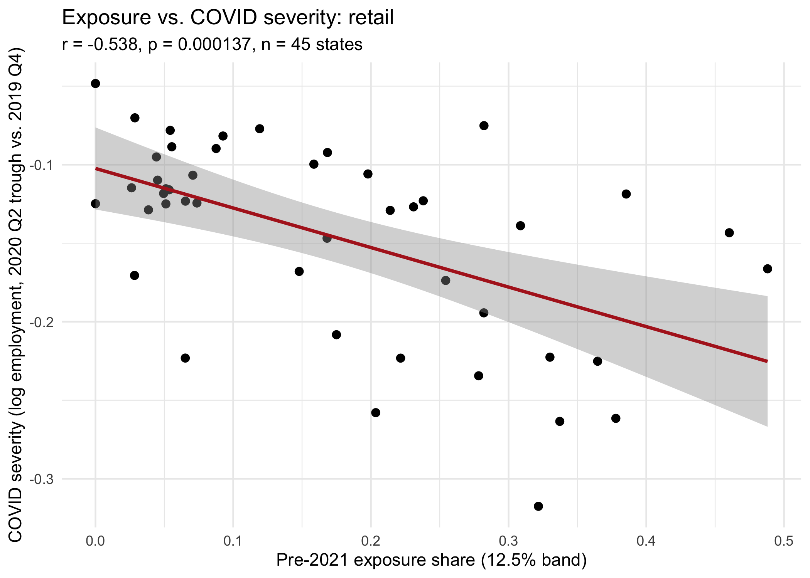

# State Minimum Wage Increases and Low-Wage Employment

A difference-in-differences study of the 2021 round of state minimum-wage
increases, extended beyond a single average treatment effect to ask how
the employment response varies with pre-policy wage exposure.

**Finding:** the baseline estimate is negative but not credible as a
causal effect — pre-trends are violated for food service, and it's
highly sensitive to differential COVID recovery. The exposure-gradient
hypothesis is underpowered *and*, per four independent checks,
confounded by a pre-existing association unrelated to the 2021 policy.
See [Results at a Glance](#results-at-a-glance).

## Research Questions

**Primary:** How does the employment response to state minimum-wage
increases vary with pre-policy minimum-wage exposure across low-wage
industries?

**Secondary:**
1. Does minimum-wage treatment affect employment in food service and retail?
2. Is the effect larger where exposure is greater?
3. Does the effect differ across Census regions?
4. How sensitive are these conclusions to alternative treatment definitions
   and inference procedures?

This is a Card-Krueger-style state minimum-wage DiD design; the
contribution is a specific empirical angle (modeling how the effect
scales with exposure) plus stress-testing that model with every
credibility check the data will support.

## Key Metrics

| | |
|---|---|
| **Sample** | 50 states, quarterly 2015-2022 (1,260 obs in the estimation panel) — 20 treated, 25 control, 5 excluded |
| **Model A, β₃** (avg. effect) | -0.025 food service (p=0.12), -0.010 retail (p=0.39); significant only in the ≥$0.50 subsample |
| **Model C, β₄** (exposure gradient) | 0.167 food service (p=0.34), -0.005 retail (p=0.95) — noisy and inconsistent in sign |
| **Robustness on β₄** | 4/4 independent checks (placebo, permutation, event study, spec curve) flag it as confounded |
| **Inference** | State-clustered SEs, wild cluster bootstrap, 10,000-rep permutation test, Monte Carlo power analysis |
| **Engineering** | 26 R scripts, 125 test blocks (all passing), CI on every push, `make all` for full reproduction |

## Results at a Glance

| Question | Result | Interpretation |
|---|---|---|
| Average employment effect | Negative but not robust | Weak causal evidence |
| Parallel trends | Violated (food service) | Major identification concern |
| COVID sensitivity | Large change once controlled for | Confounding likely |
| Exposure gradient (β₄) | Inconclusive and confounded | Underpowered, not "no effect" |
| Placebo / permutation / event study / spec curve (β₄) | All 4 flag a pre-existing exposure-outcome link | Convergent evidence, not one fluke |
| Exposure vs. COVID severity | Significant negative correlation | A candidate mechanism — but controlling for it barely moves the placebo effect |
| Multiple-testing correction | None of the 4 confirmatory tests survive Holm | Consistent with "not robust," now formal |
| Leave-one-state-out | Estimate stable across all 20 drops | No single state drives Model A |

## Key Figures

<table>
<tr>
<td width="50%">

**Which states were treated, and by how much**


</td>
<td width="50%">

**Event study: pre-trends don't hold for food service**


</td>
</tr>
<tr>
<td width="50%">

**Baseline vs. COVID-adjusted estimate**


</td>
<td width="50%">

**Pre-2021 exposure distribution by industry**


</td>
</tr>
</table>

**Does the treatment effect scale with exposure?**


**All four confirmatory estimates at a glance**


**Every reasonable band × sample × industry choice, ranked**


**Exposure predicts COVID severity — a candidate mechanism for the confound**


More figures — model diagnostics, permutation-test null distributions,
power-analysis curves, the beta4 event study and forest plot — are in
`reports/figures/` and embedded in the
[full report](reports/final_report.Rmd).

## Final Report

**[Read the rendered report](https://github.com/Charith-Reddy-Pareddy/min-wage-difference-in-differences-study/releases/tag/v1.0-report)**
— no cloning required. Or render
[reports/final_report.Rmd](reports/final_report.Rmd) directly:

```
Rscript -e 'rmarkdown::render("reports/final_report.Rmd")'
```

(needs [pandoc](https://pandoc.org) — `brew install pandoc` on macOS).

## Limitations

- **Parallel trends violated** for food service (event study + two-sample t-test).
- **COVID-era differential recovery confounds the treatment window** — a
  real share of the baseline estimate, not the policy.
- **Both β₃ and β₄ are underpowered** at the observed effect sizes
  (`R/16_power_analysis.R`), not just assumed underpowered.
- **β₄ is also confounded**, not just underpowered — 4 independent
  checks find high/low-exposure states already differed before 2021. A
  candidate mechanism (exposure correlates with COVID severity) was
  tested directly by controlling for it in the placebo spec
  (`R/25`-`R/26`) — the effect barely shrank. See report Section 8.1.
- **The ≥$0.50 subsample and the legislated-only subsample are the exact
  same 10 states** — the two cuts can't be disentangled in this data.
- **Small cluster count** (20 treated, 45 total) — addressed via
  clustered SEs and a wild bootstrap, but always some caution.
- **Exposure-measure construction, spillovers, anticipation effects, and
  external validity** are documented but not fully resolved.
- Results are **DiD estimates under this specification**, not definitive
  causal effects — see the full report's Limitations section for detail.

## What I Learned

A significant DiD estimate isn't sufficient evidence of a causal effect.
The event study and COVID-sensitivity spec caught exactly the failure
modes they were built to catch. Extending the same rigor to the exposure
gradient afterward — power analysis, four robustness checks, then a
direct test of the candidate confounding mechanism — reinforced it from
another angle: a fragile result isn't evidence of "no effect," and
proposing a mechanism isn't the same as confirming one.

## Data Sources

| Source | Role |
|---|---|
| FRED (public API) | State-quarter employment, GDP, population, 2015-2022 |
| U.S. DOL minimum wage history | Treatment classification |
| QCEW Open Data API | Fallback employment (2 states); validation check |
| CPS-ORG via IPUMS-CPS | Exposure construction (2019-2020 earnings only) |

## How to Reproduce

```
Rscript -e 'renv::restore()'   # pinned package versions (renv.lock, R 4.5.1)
make all                       # R/01-R/26, tests, figures, report end to end
make test                      # just the test suite
make report                    # just render reports/final_report.Rmd
```

`make all` needs `IPUMS_API_KEY` in `.env` (see `.env.example`) for
`R/03`, and takes several minutes (CPS-ORG pull, wild bootstrap,
permutation test, power simulation are the slow steps). Rendering the
report needs [pandoc](https://pandoc.org), separate from `renv.lock`.

Repo layout: `R/` (26 numbered scripts, run in order), `tests/` (one
file per script), `reports/` (`final_report.Rmd`, rendered HTML,
figures), `data/processed/` (all results, gitignored, reproducible).
CI (`.github/workflows/ci.yml`) parse-checks `R/`, verifies every script
is wired into the Makefile and has a matching test file
(`scripts/check_pipeline_sync.R` — also runnable locally as
`make check-sync`), and runs the test suite, on every push.

## Status

Complete. See [TIMELINE.md](TIMELINE.md) for the day-by-day build log,
including every defect found and corrected along the way. The original
10-day build covered treatment classification through the final report;
11 new scripts (`R/16`-`R/26`) and 4 extended ones (`R/08`, `R/10`,
`R/11`, `R/15`) were added afterward — the power analyses, robustness
checks, and mechanism investigation summarized above.
