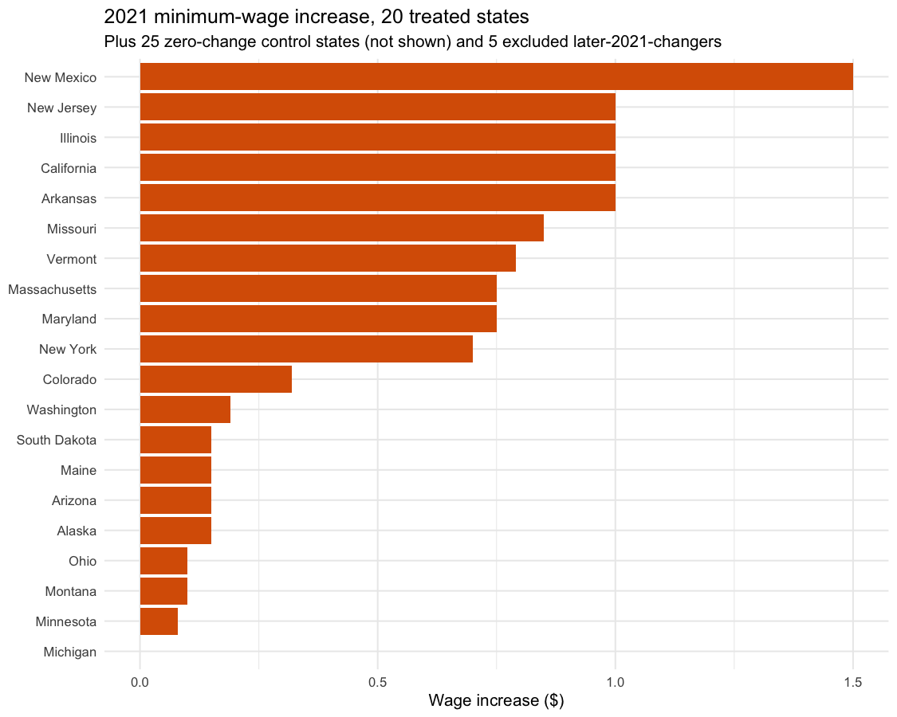
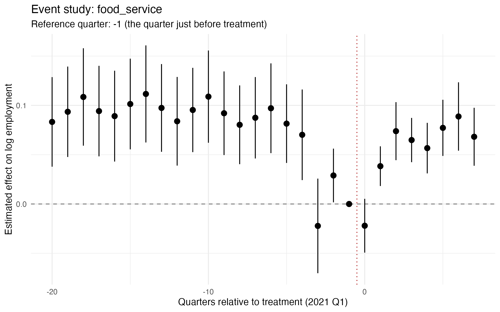
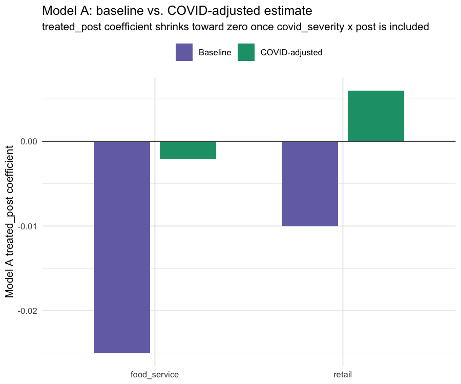
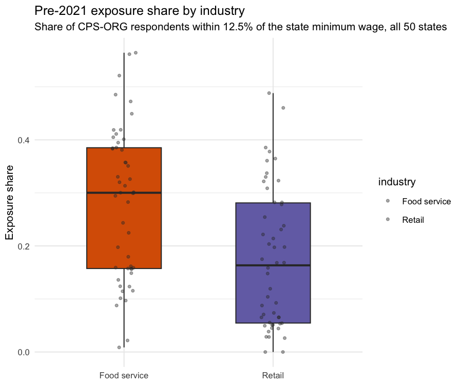
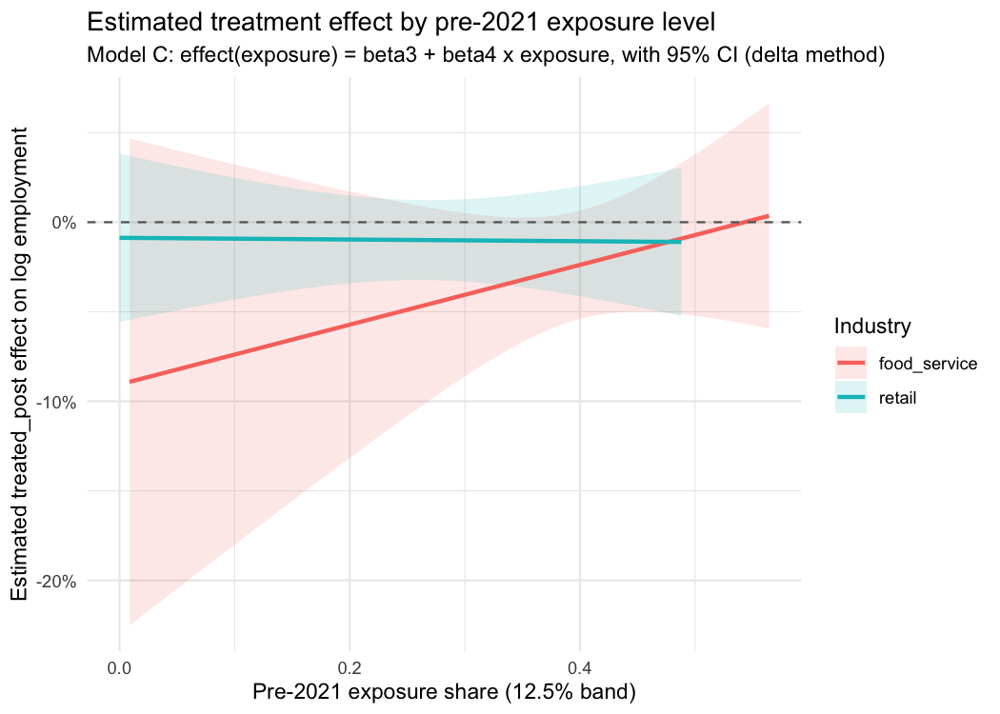
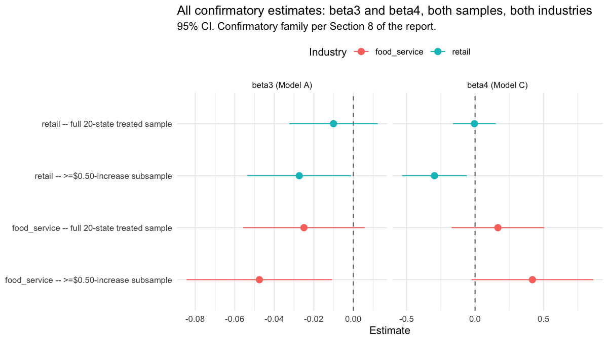
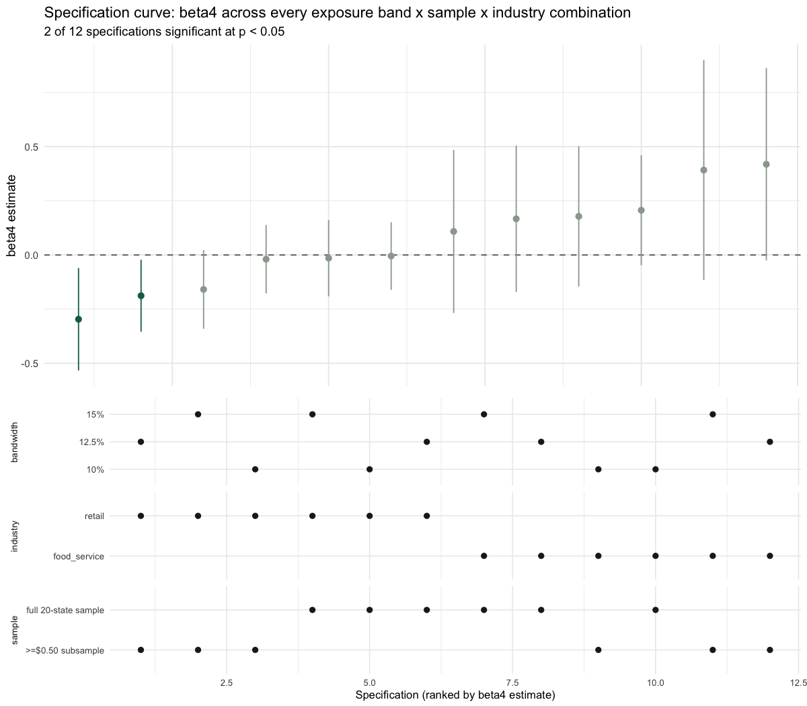
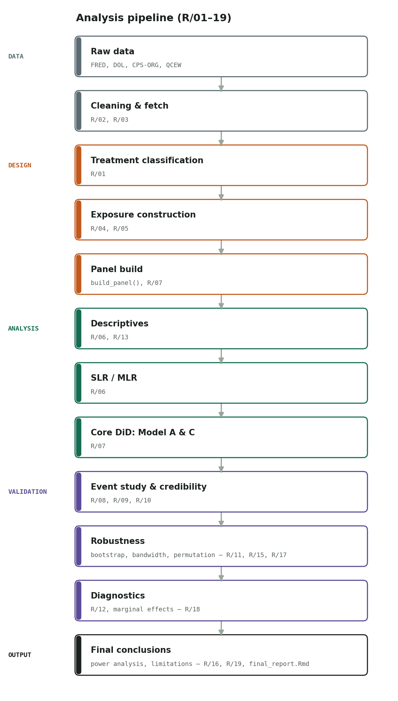

# State Minimum Wage Increases and Low-Wage Employment: A Difference-in-Differences Study with Power, Heterogeneity, and Robustness Analysis

**Finding:** the baseline DiD estimate is negative but not credible as a
causal estimate — pre-trends are violated for food service, and the
estimate is highly sensitive to differential COVID recovery. The
exposure-gradient hypothesis is underpowered at the effect sizes actually
observed. See [Results at a Glance](#results-at-a-glance) below.

A difference-in-differences study of the 2021 round of state minimum wage
increases, extended beyond a single average treatment effect to ask how the
employment response varies with pre-policy wage exposure.

**30-second version:**

| | |
|---|---|
| **Question** | Does the employment effect of 2021 state minimum-wage increases vary with pre-policy exposure? |
| **Data** | 50 states, quarterly 2015-2022 — FRED/QCEW employment + CPS-ORG (IPUMS) exposure |
| **Method** | Two-way fixed-effects DiD, event study, placebo test, state-clustered and wild-bootstrap inference, permutation test, Monte Carlo power analysis |
| **Baseline estimate** | Small negative average effect, significant only in the ≥$0.50-increase subsample |
| **Main finding** | The baseline estimate is not robust: pre-trends fail for food service, and a COVID-recovery confound explains a real share of it |
| **Main limitation** | The exposure-gradient hypothesis (β₄) is underpowered at the effect sizes actually observed — quantified, not just assumed |

See [Key Figures](#key-figures) below or jump to the [full report](reports/final_report.Rmd) / [Limitations](#limitations).

## Results at a Glance

| Question | Result | Interpretation |
|---|---|---|
| Average employment effect | Negative but not robust | Weak causal evidence |
| Parallel trends | Violated (food service) | Major identification concern |
| COVID sensitivity | Large change once controlled for | Confounding likely |
| Exposure gradient (β₄) | Inconclusive | Underpowered, not "no effect" |
| Exposure bandwidth (10%/12.5%/15%) | Consistent across all three | Not an artifact of band choice |
| Placebo test | Null | Helpful credibility check |
| Treatment-intensity (exploratory) | Directionally consistent | Not confirmatory — increase size isn't randomly assigned |
| Leave-one-state-out | Estimate stable across all 20 drops | No single state is driving Model A |
| Multiple-testing correction | None of the 4 confirmatory tests survive Holm | Consistent with "not robust," now formal |
| Specification curve (12 specs) | Only 2 of 12 significant; sign flips by industry | Retail's negative effect is subsample-dependent, food service never significant |

## Research questions

**Primary:** How does the employment response to state minimum-wage
increases vary with pre-policy minimum-wage exposure across low-wage
industries?

**Secondary:**
1. Does minimum-wage treatment affect employment in food service and retail?
2. Is the effect larger where exposure is greater?
3. Does the effect differ across Census regions?
4. How sensitive are these conclusions to alternative treatment definitions
   and inference procedures?

This builds on a standard Card-Krueger-style state minimum wage DiD design.
The contribution isn't a new question but a specific empirical angle: moving
from one average treatment effect to modeling how that effect scales with
exposure.

## Key Figures

<table>
<tr>
<td width="50%">

**Which states were treated, and by how much**


</td>
<td width="50%">

**Event study: pre-trends don't hold for food service**


</td>
</tr>
<tr>
<td width="50%">

**Baseline vs. COVID-adjusted estimate**


</td>
<td width="50%">

**Pre-2021 exposure distribution by industry**


</td>
</tr>
</table>

**The central scientific question, visually: does the treatment effect scale with exposure?**


**All four confirmatory estimates at a glance**


**Every reasonable band x sample x industry choice, ranked**


More figures — model diagnostics, permutation-test null distributions,
the power-analysis curves, exposure-bandwidth sensitivity, leave-one-out
sensitivity — are in `reports/figures/` and embedded in the
[full report](reports/final_report.Rmd).

## Final report

**[Read the rendered report](https://github.com/Charith-Reddy-Pareddy/min-wage-difference-in-differences-study/releases/tag/v1.0-report)** —
no cloning required.

**[reports/final_report.Rmd](reports/final_report.Rmd)** is the complete
write-up — render it with `Rscript -e 'rmarkdown::render("reports/final_report.Rmd")'`
(needs [pandoc](https://pandoc.org), `brew install pandoc` on macOS) to get
`reports/final_report.html`. It reads the pre-computed results in
`data/processed/` and the figures in `reports/figures/`, so rendering it
is fast; regenerating those from scratch is the "How to reproduce" section
below.

**Headline finding:** the credibility checks (event study, a two-sample
t-test, a COVID-sensitivity spec, a placebo test) found a real problem,
not a clean result. Pre-COVID trends between treated and control states
weren't parallel for food service employment — confirmed by two
independent methods — and the baseline average-effect estimate is highly
sensitive to differential COVID recovery across states. That's reported
as a direct limit on how much weight the headline number can carry, which
is what the proposal's own design built these checks to catch.

## Limitations

- **Parallel trends are violated**, particularly for food service —
  confirmed by both the event study's joint pre-trend test and an
  independent two-sample t-test.
- **COVID-era differential recovery confounds the treatment window**: a
  real share of the baseline estimate is attributable to differential
  COVID recovery across states, not minimum-wage policy.
- **Both the average effect (β₃) and the exposure-gradient specification
  (β₄) are underpowered** at the effect sizes actually observed —
  quantified by a design-based Monte Carlo sensitivity analysis
  (`R/16_power_analysis.R`), not just assumed. The simulation quantifies
  which effect sizes this design could realistically distinguish from
  zero — it's a property of the design, not a way of explaining away a
  noisy result after the fact. β₃'s MDE isn't reached anywhere in the
  proposal's own 0.5%-3% assumed range for either industry, which is why
  Model A only came back significant in the ≥$0.50-increase subsample.
- **The ≥$0.50-increase subsample and the legislated-only subsample are
  the exact same 10 states** — the dollar-threshold cut and the
  legislated-vs-automatic mechanism cut can't be disentangled in this
  data, not just partially confounded.
- **A relatively small number of treated states** (20, or 10 in the
  ≥$0.50 subsample) — addressed via state-clustered SEs and a wild
  cluster bootstrap for both β₃ and β₄, but inference with this few
  clusters always carries some caution.
- **Exposure-measure construction is a documented choice, not the only
  defensible one** (band width, cell-pooling rules).
- **Spillovers between neighboring states, anticipation effects ahead of
  the 1/1/2021 effective date, and the COVID-era window's external
  validity** are none of them modeled or corrected for.
- **The permutation test is a reference distribution, not evidence of a
  randomized experiment** — states chose whether and when to raise
  wages, so permuting labels tests against a null of no effect, not a
  null of as-if-random assignment.
- Results should be read as **DiD estimates under this specification**,
  not as definitive causal effects — see the [full report](reports/final_report.Rmd)'s
  Limitations section for the complete list and detail.

## What I learned

A statistically significant DiD estimate isn't sufficient evidence of a
causal effect on its own. The event study revealed a parallel-trends
violation, and the COVID-sensitivity spec showed that differential
recovery across states explained a substantial share of the baseline
estimate — both are exactly the failure modes the proposal's own
credibility-check design was built to catch, and they showed up. Adding
the quantitative power analysis afterward reinforced the same lesson
from a different angle: a null or noisy result on the exposure-gradient
hypothesis isn't itself evidence of "no gradient" when the design can't
reliably detect an effect that size in the first place. I treat the
causal interpretation here as limited, not the baseline coefficient as
definitive.

## Data sources

| Source | Role |
|---|---|
| FRED (public API) | State-quarter employment (food service, retail), GDP, population, 2015-2022 |
| U.S. DOL minimum wage history (Wayback Machine snapshots) | Treatment classification |
| QCEW Open Data API | Fallback employment series for 2 states FRED doesn't publish; wage-ratio validation check |
| CPS-ORG via IPUMS-CPS | Exposure measure construction (2019-2020 earnings only) |

## Analysis Pipeline



Sixteen scripts (nineteen counting the post-build additions) run in
order, each reading the previous one's output from `data/processed/`
and writing its own back. See [How to reproduce](#how-to-reproduce) for
the exact commands.

## Repo layout

```
data/raw/        source pulls, not committed (see .gitignore)
data/processed/  cleaned panel data + all analysis results, not committed
R/               numbered scripts, 01 through 16, run in order
scripts/         presentation-only figure generation (not part of the analysis pipeline)
reports/         final_report.Rmd, rendered HTML, and all figures
tests/           unit tests, one file per R/ script
.github/workflows/ CI: parse-checks R/ and runs the test suite on every push
renv.lock        pinned package versions (see Environment below)
```

## Environment

Package versions are pinned via [renv](https://rstudio.github.io/renv/)
in `renv.lock` (R 4.5.1). To restore the exact environment:

```
Rscript -e 'renv::restore()'
```

Key packages: `fixest`, `dplyr`, `readr`, `sandwich`, `testthat`,
`rmarkdown`, `knitr`, `ggplot2`. Rendering the report additionally needs
[pandoc](https://pandoc.org) (`brew install pandoc` on macOS), which
isn't an R package and isn't in `renv.lock`.

## How to reproduce

**One command**, from the repo root, after `renv::restore()`:

```
make all      # runs R/01 through R/23, the test suite, the summary figures, then the report
make test     # just the test suite
make figures  # just the README's summary figures (scripts/generate_readme_figures.R)
make report   # just renders reports/final_report.Rmd against existing data/processed/
```

`make all` needs `IPUMS_API_KEY` set in `.env` (see `.env.example`) for
`R/03`, and takes several minutes end to end (`R/03`'s CPS-ORG pull,
`R/11`'s wild bootstrap (now both β₃ and β₄, ~4 min), `R/15`'s
permutation test, and `R/16`'s power simulation are each the slowest
part of their respective scripts, roughly 2-9 min combined).

Equivalently, without `make`, run the numbered scripts in `R/` directly
in order from the repo root — each one reads the previous scripts'
outputs from `data/processed/` and writes its own back there (plus
figures to `reports/figures/`), so order matters:

```
R/01_treatment_classification.R
R/02_fetch_fred_data.R          # ~2 min, pulls all 50 states from FRED
R/03_fetch_cps_org.R            # needs IPUMS_API_KEY in .env; ~2-5 min
R/04_exposure_measure.R
R/05_exposure_validation.R
R/06_slr_mlr.R
R/07_model_a_c.R
R/08_event_study.R
R/09_covid_sensitivity.R
R/10_placebo_test.R
R/11_cluster_bootstrap.R        # ~4 min, 999-rep wild bootstrap for beta3 and beta4
R/12_model_diagnostics.R
R/13_two_sample_ttest.R
R/14_regional_anova.R
R/15_permutation_test.R         # ~3 min, 10,000-rep permutation test
R/16_power_analysis.R           # ~5 min, 30-point x 500-rep power simulation
R/17_exposure_bandwidth_sensitivity.R  # refits Model C at 10%/12.5%/15% exposure bands
R/18_marginal_effects.R         # treatment-effect-vs-exposure curve with 95% CI
R/19_treatment_intensity.R      # exploratory continuous-dollar-increase model
R/20_leave_one_out.R            # ~20 sec, drop each treated state once, refit Model A
R/21_coefficient_forest_plot.R  # unified beta3/beta4 CI plot across all specifications
R/22_multiple_testing_correction.R  # Holm-adjusted p-values, confirmatory family
R/23_specification_curve.R      # beta4 across all 12 band x sample x industry specs
```

Then `testthat::test_dir("tests")` should show every test passing,
and `reports/final_report.Rmd` should render cleanly against the outputs
those scripts just produced. CI (`.github/workflows/ci.yml`) runs the
parse-check and test suite on every push — it doesn't run the full
pipeline or render the report, since those need live API credentials and
several minutes; see the workflow file for why.

## Status

See [TIMELINE.md](TIMELINE.md) for the day-by-day build schedule.

**Day 1:** Treatment classification table drafted, validated by
`R/01_treatment_classification.R`.

**Day 2:** Treatment table source-checked against DOL's historical minimum
wage tables (two Wayback Machine snapshots, straddling the Jan 1, 2021
changes). 24 of 25 states matched the draft exactly; Michigan's 2021
increase turned out not to have happened at all (see the note at the top of
`R/01_treatment_classification.R`) and has been corrected. That also
resolves the earlier "10 vs. 9 states below $0.50" open item: the correct
count is 10, and the proposal text's "9" looks like a minor error in the
proposal narrative rather than a data problem.

`R/02_fetch_fred_data.R` pulls real state-quarter employment (food service,
retail), GDP, and population for all 25 states from FRED's public endpoint
(2015-2022). FRED doesn't publish the food-service employment series for
New Mexico or South Dakota (confirmed 404, not assumed); those two states
fall back to QCEW's Open Data API instead, converted to the same thousands
scale FRED uses.

**Day 3:** `R/03_fetch_cps_org.R` pulled real CPS-ORG microdata (all 24
monthly 2019-2020 Basic samples, ORG respondents only — a hardcoded
"January of each year" guess turned out to be wrong on the first attempt;
see the comment above `resolve_cps_org_samples()`).

`R/04_exposure_measure.R` builds the exposure share (workers within 10%,
12.5%, and 15% of the pre-2021 state minimum wage) per state-industry cell,
weighted by `EARNWT`. All 50 state-industry cells clear the proposal's
n=30 threshold on the full 2019-2020 pool, so no pooling-across-quarters
fallback was needed in practice.

`R/05_exposure_validation.R` runs both Day 3 validation checks:
- **QCEW correlation check** (Section 3): QCEW's average wage (hourly
  proxy) over the state minimum wage, correlated against the CPS-ORG
  exposure share. Both industries show the expected negative relationship
  (food service: -0.76, retail: -0.33) — neither flagged.
- **Exposure-distribution check** (Section 5): food service exposure is
  higher than retail in 24 of 25 states (mean 0.415 vs. 0.294, Wilcoxon
  signed-rank p < 0.0001), confirming the two industries genuinely differ
  in exposure before that difference is used in Model C.

Processed outputs land in `data/processed/` (gitignored, reproducible by
re-running the scripts in order).

**Day 4:** `R/06_slr_mlr.R` builds the derived per-state outcome from
Section 4.1 — each state's average log employment change, pre-period
(2019-2020) to post-period (2021-2022) — separately for food service and
retail, and fits:
- **SLR** (Section 7): log employment change on the dollar size of the
  wage increase, treated states only. Not significant for either industry
  (food service p=0.46, retail p=0.62) — consistent with the proposal's
  own pre-registered expectation (Section 15) of a small, possibly
  inconclusive effect, not a modeling problem.
- **MLR** (Section 6.1): log employment change on treatment status, GDP
  growth, population growth, and Census region.

Scatter/fitted-line/CI-band and residuals-vs-fitted plots for both SLR
models are in `reports/figures/`. These are the STAT 240/340
coursework-closure pieces (Section 9), not the study's identification
strategy — that's Model A/C (Day 5) and the event study (Day 7).

**Correction (found while starting Day 5):** the proposal names the 20
treated and 5 excluded/secondary states explicitly (Section 4.2) but never
lists the actual control group ("states with no 2021 change") its own
design depends on. The original Day 4 MLR ran on the only 25 states
classified at the time (20 treated + the 5 later-2021-changer "excluded"
states), which isn't a real treated-vs-control comparison — those 5 states
raised wages too, just not on 1/1/2021. Added a real control group: the
other 25 states, each source-checked against DOL snapshots from Dec 2020,
Feb 2021, and Dec 2021, confirming zero minimum-wage movement across all
of 2021 (see the note in `R/01_treatment_classification.R`). The MLR now
runs on treated + control (45 states), with the "excluded" group correctly
left out of the primary specification. Result changed in a meaningful way:
the treated coefficient is now null for both industries (food service
p=0.65, retail p=0.26) rather than marginally significant for food
service — the earlier result was likely an artifact of the contaminated
comparison group, not a real signal.

**Day 5:** `R/07_model_a_c.R` is the study's actual identification
strategy (Section 6.2) — everything before this was coursework-closure or
setup. Two-way fixed-effects (state + quarter), state-clustered SEs, on
the treated + control panel (2016Q1-2022Q4; the growth covariates need a
4-quarter lag, which consumes 2015). Run for both industries and both the
full 20-treated-state sample and the ≥$0.50-increase subsample:

- **Model A** (β₃, the average effect): negative in all 4 specifications,
  but only significant in the ≥$0.50 subsample (food service p=0.016,
  retail p=0.049) — the full sample includes states with increases as
  small as $0.00-0.19, which dilutes the average effect toward zero,
  same story the proposal's own sensitivity threshold is designed to
  surface.
- **Model C** (β₄, the primary hypothesis): noisy and inconsistent in
  sign across specifications — positive for food service, negative for
  retail, significant only in the ≥$0.50 subsample. This is close to
  what Section 4.4 pre-registers as the expected outcome: a design that
  may not reliably distinguish "no gradient" from "real gradient" given
  the sample size. (Note added Day 10: the formal quantitative power
  simulation from Section 4.4 was never actually built in this 10-day
  compressed build — this line originally promised it for "a later
  day" that never came. **Later update:** it was built afterward, as a
  post-build addition — see `R/16_power_analysis.R` and TIMELINE.md's
  power-analysis notes.)
- Every `fixest` Model A estimate was cross-checked against an
  independent `lm()` + `sandwich::vcovCL()` fit — coefficients and
  clustered SEs matched to 4+ decimal places in all 4 specifications.

Full regression output and the 4-specification summary table are in
`data/processed/model_a_c_results.csv` (gitignored, reproducible).

**Day 7:** `R/08_event_study.R` (Sections 5, 6.4, 6.5) and
`R/09_covid_sensitivity.R` (Section 6.5's supporting check).

The event study is a real, meaningful finding — not a clean pass. The
joint test that all pre-period leads equal zero **rejects** flat
pre-trends for both industries (food service F=4.77, p<0.0001; retail
F=3.09, p=0.001). The shape isn't a gradual pre-trend drift so much as a
roughly stable, non-zero gap between treated and control states across
most of the sample (both pre- and post-period), plus one sharp anomalous
dip at quarter -3 relative to treatment — which is **2020 Q2, the COVID
employment trough** — most visible in retail. Plots:
`reports/figures/event_study_food_service.png` and `_retail.png`.

The COVID-sensitivity spec confirms why: adding `covid_severity x post`
(log employment change from 2019 Q4 to the 2020 Q2 trough, interacted
with the post indicator — a bare state-constant term would be fully
absorbed by the state fixed effect, the same collinearity `exposure` hit
in Model C, so it has to enter interacted) is highly significant in every
specification (p < 10⁻⁸). Once included, Model A's `treated_post`
shrinks toward zero (food service: -0.025 → -0.002; retail: -0.010 →
+0.006) and Model C's β₄ shifts substantially, even flipping sign for
retail (-0.005 → +0.102). Differential COVID recovery, not the minimum
wage policy, explains a real share of what Day 5's baseline specification
picked up.

Per Section 6.5, this is reported as a direct limit on how much weight
the Day-5 headline numbers can carry, not something to patch over — the
event study and this sensitivity check are exactly the tools the proposal
specifies for catching it, and they did.

**Day 8:** `R/10_placebo_test.R`, `R/11_cluster_bootstrap.R`,
`R/12_model_diagnostics.R` (Sections 6.4, 8, 11).

**Placebo test**: a false treatment date (2018-01-01), restricted to a
pre-COVID, pre-real-treatment window (2016-2019) so it isn't just
re-detecting the confound Day 7 already found. Clean result: small,
non-significant estimates for both industries (food service p=0.29,
retail p=0.43) — the design doesn't manufacture effects from nothing when
there's no real policy change to detect.

**Wild cluster bootstrap for β₄** (Cameron-Gelbach-Miller): `fwildclusterboot`,
the standard package for this, was pulled from CRAN in 2024 and doesn't
install on current R, so the procedure is implemented directly (999
Rademacher-weight replications, restricted-model residuals — see the
header comment in `R/11_cluster_bootstrap.R`, including a note on where
the proposal's own wording is internally inconsistent about which
bootstrap variant it means). On the real 20-treated-state panel, bootstrap
p-values track the asymptotic ones closely (food service: 0.367 vs. 0.338
asymptotic; retail: 0.953 vs. 0.953) — both 95% CIs include zero,
confirming Day 5's asymptotic β₄ result rather than overturning it.

Building the test suite for this surfaced a real property of the method
worth knowing, not a bug: with very few treated clusters (~5, tried
first) and a treatment effect large enough to badly misspecify the
restricted null model, the wild bootstrap's reference distribution
becomes numerically unstable. Confirmed by testing 10 vs. 30 synthetic
states directly. Real Day 5-8 data (20 treated states) is comfortably
outside that regime.

**Model diagnostics** (Section 11) for Model A, both industries — 4-panel
plots in `reports/figures/model_a_diagnostics_{food_service,retail}.png`.
Residuals are non-normal by a Shapiro-Wilk test (p≈0 both industries,
though with 1,260 observations that test is hypersensitive to small
deviations). More informative: the specific highest-leverage points in
both industries are 2020 Q2-Q3 observations — Vermont and New York (Q2
2020), Hawaii (Q3 2020, heavily tourism-dependent) — the same COVID window
Day 7 already flagged as the central identification threat, not a new or
separate data problem. No single observation is extreme by Cook's
distance (max 0.046, food service), so results aren't being driven by one
outlier state.

**Day 9:** `R/13_two_sample_ttest.R`, `R/14_regional_anova.R`,
`R/15_permutation_test.R` (Section 10, STAT 240/340 coursework closure).

**Two-sample t-test** on pre-period (2019 Q1 → 2020 Q4) employment
trends, treated vs. control: **food service shows a real, significant
difference** (treated -0.197 vs. control -0.118, t=3.03, p=0.0043) —
treated states' food-service employment was already declining faster
than control states' *before* treatment started. This independently
corroborates Day 7's event-study pre-trend violation using a completely
different, simpler method — not a new problem, the same one confirmed a
second way. Retail shows no such difference (p=0.30), consistent with
its weaker pre-trend violation in Day 7.

**Descriptive statistics** (mean/SD of the pre-period trend, by group ×
industry × increase type) in `data/processed/descriptive_statistics.csv`.

**One-way regional ANOVA** (exploratory, Section 6.3): regions differ
significantly in log employment change for both industries (food service
F=5.10, p=0.0039; retail F=5.64, p=0.0022) — West notably higher than
Midwest/South. Real geographic heterogeneity, unrelated to treatment;
doesn't override Model C, which remains the formal heterogeneity test.
Boxplots (by region and group) in
`reports/figures/regional_boxplot_{food_service,retail}.png`.

**Monte Carlo permutation test**, Model A only, 10,000 relabelings of
which states are "treated" (state-level, not row-level, holding n_treated
fixed at the real design's count): permutation p-values track the
asymptotic Day-5 ones closely (food service: 0.09 vs. 0.118 asymptotic;
retail: 0.377 vs. 0.385 asymptotic) — another confirmation, not a
reversal. Null-distribution histograms in
`reports/figures/permutation_test_{food_service,retail}.png`.

**Day 10:** [reports/final_report.Rmd](reports/final_report.Rmd) — the
full write-up, structured per the proposal's own required narrative order
(Section 6.5: credibility checks presented and interpreted before any DiD
coefficient, not in the order they were actually built).

**Reproducibility check**: ran every script, `R/01` through `R/15`, in a
single clean sequential pass from the repo root. It caught one real bug
before this was called done: `R/05_exposure_validation.R` had its own
duplicated copy of `R/02`'s `STATE_FIPS` table (a deliberate Day-3 choice
to avoid a fragile relative `source()` path), and that copy silently went
stale the moment Day 5 added 25 control states to `R/02`'s version —
`R/05` still only knew the original 25 states, so it errored on the
26th (`Unknown state: Alabama`) the moment something outside its own test
suite actually exercised the full 50-state list. Fixed by switching
`R/05` to the same source()-both-paths pattern `R/07` onward already
uses, which can't drift out of sync since there's only one copy of the
table left. Re-ran the full 14-script chain afterward: clean pass,
and every regenerated number in `data/processed/` matched the figures
already cited in the report to full precision.

**Post-build additions (not part of the original 10 days):** `R/16_power_analysis.R`
(the Monte Carlo power simulations for both β₃ and β₄ flagged as
missing above — the proposal's Section 4.4 specifies both), the
increase-type composition columns in `model_a_c_results.csv` (Section
4.2's "carried through the results tables" requirement), four
limitations items from the proposal's Section 13 that hadn't made it
into the report (spillovers, anticipation effects, external validity,
the permutation test's reference-distribution caveat), `renv.lock` for
pinned dependencies, `Makefile` for one-command reproduction,
`.github/workflows/ci.yml` for CI, and the summary figures in the
[Key Figures](#key-figures) section. See TIMELINE.md for detail.
